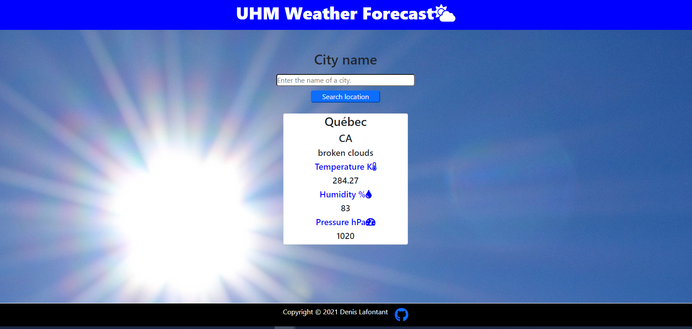

# Weather App

A weather check application built with JavaScript and the open weather API

- Users can check the weather condition of any city. They input the name of the city and data about the weather of the city is returned and displayed to them.

## 🔨 Tested with

Eslint

## Usage

- Open a terminal.
- Clone the repo by typing that command `git clone https://github.com/icebox827/weather-app.git`  

## Live demo

[clik here!](https://icebox827.github.io/Restaurant-Page//.)

## 🔨 Technologies

- HTML5
- CSS3
- Javascript
- npm
- WebPacker
- VSCode
- Bootstrap
- Linters
- Open Weather API

## Author

👤 **Denis Lafontant**

- GitHub: [@icebox827](https://github.com/icebox827)
- Twitter: [@heracles2k5](https://twitter.com/@heracles2k5)
- LinkedIn: [LinkedIn](https://www.linkedin.com/in/denis-lafontant/)

## 🤝 Contributing

Contributions, issues, and feature requests are welcome!

Feel free to check the [issues page](https://github.com/icebox827/weather-app/issues/2).

## Show your support

Give a ⭐️ if you like this project!

### Acknowledgements

- Microverse
- The Odin Project

## 📝 License

This project is [MIT](./LICENSE) licensed.
